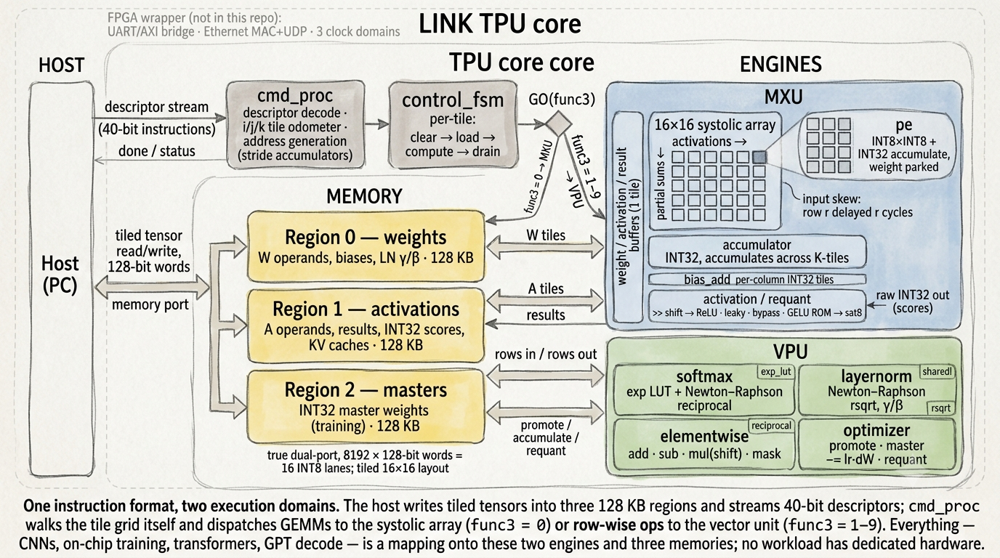

# LINK TPU — an instruction-driven 16×16 systolic INT8 tensor processor

A small but complete **general tensor processor** in SystemVerilog: a
self-tiling INT8 GEMM engine plus a microcoded vector unit, in front of
on-chip memory. The host loads operands and streams short instructions; the
chip does the rest — any-size matrix products, softmax, layernorm, GELU,
elementwise ops, and an on-chip SGD optimizer.

Every module and every workload in this repository is verified **bit-exact**
against an independent pure-integer Python model (cocotb + Verilator). On this
one unchanged core, the included testbenches run — in increasing order of
ambition — a full GEMM sweep, a trained CNN, **on-chip training** (the chip
learns MNIST from scratch), a Vision Transformer, and a character-level
**GPT that generates text through a resident KV cache**.

This repository is the **portable, simulator-only core**. The same RTL closes
timing at **100 MHz on a Xilinx Arty A7-100T** (240 DSPs) behind board-specific
UART and hand-written Ethernet/UDP host links, which are kept out of this tree
on purpose.

## Table of contents

- [Motivation](#motivation)
- [Architecture](#architecture)
  - [Processing element and systolic array](#processing-element-and-systolic-array)
  - [On-chip memory](#on-chip-memory)
  - [The matrix unit (MXU) drain path](#the-matrix-unit-mxu-drain-path)
  - [The vector unit (VPU)](#the-vector-unit-vpu)
  - [Command processor](#command-processor)
- [Instruction set](#instruction-set)
- [Example instruction sequence](#example-instruction-sequence)
- [Verification and results](#verification-and-results)
- [Setup](#setup)
- [Running the testbenches](#running-the-testbenches)
- [Adding a testbench](#adding-a-testbench)
- [Beyond this repository](#beyond-this-repository)
- [License](#license)

## Motivation

This is a solo, bottom-to-top chip design project: it started as a single
INT8 multiply-accumulate cell and grew — one verified module at a time — into
a general machine that trains neural networks and runs transformers on its own
silicon. Two rules shaped everything here:

1. **Dialogue before RTL.** Every architectural decision was argued and locked
   before code was written.
2. **Bit-exact or it doesn't count.** Every datapath is mirrored by a
   pure-integer Python model; hardware output must equal the model
   integer-for-integer, from a single PE test to a 67-position GPT generation.

The generality is the point. There is no CNN hardware, no attention hardware,
no training hardware in this design — there are GEMMs, row-wise vector ops,
and three memories, and every workload above is a *mapping*, not a module.

## Architecture



### Processing element and systolic array

- `pe` — one weight-stationary cell: INT8×INT8 multiply, INT32 accumulate,
  a parked weight register, and two pass-through pipelines (activations flow
  right, partial sums flow down). The activation register is clocked
  unconditionally so the diagonal wavefront never deforms.
- `systolic_array` — a 16×16 mesh (256 MACs). Activations enter row *r*
  delayed by *r* cycles (internal skewing); column *c*'s complete INT32 dot
  product emerges at the bottom edge with its own `valid`. One 16×16×16 tile
  takes 128 compute cycles.
- `weight_buffer` / `activation_buffer` / `result_buffer` — one-tile staging
  between the sequential memory port and the 16-wide array;
  `result_buffer` performs the drain transpose.

### On-chip memory

- `mem` — generic true dual-port memory, 8192 × 128-bit words (16 INT8 lanes),
  1-cycle registered reads.
- Three instances = three **regions** of 128 KB each:

| Region | Contents |
|---|---|
| 0 | weights, biases, LayerNorm γ/β — everything GEMMs read as the W operand |
| 1 | activations, results, INT32 attention scores — the working set |
| 2 | INT32 **master weights** for on-chip training (see optimizer below) |

- Tensors live in a tiled layout (16-lane words, 16-word tiles); INT32 tensors
  use 4 lanes per word. The host and the address generator share this layout
  as a contract.

### The matrix unit (MXU) drain path

Results leave the array through a short pipeline, all selectable per
instruction:

- `accumulator` — per-column INT32 accumulation **across K-tiles** (this is
  what makes arbitrary inner dimensions one instruction).
- `bias_add` — per-column INT32 bias, added pre-requantization.
- activation / requantize — arithmetic right shift (the quantization
  exponent), then one of **ReLU · leaky-ReLU · bypass · GELU** (the GELU is a
  256-entry ROM on a Q4 grid, folded inline into the drain), then saturate to
  INT8. A config bit bypasses all of it and writes the **raw INT32
  accumulators** instead — attention scores need full precision until softmax.

### The vector unit (VPU)

A microcoded row engine for everything that is not a matrix product. It shares
the memory regions with the MXU and is dispatched by the same instruction
format:

- **softmax** — per row: max-subtract, base-2 exponential (256-entry LUT +
  exponent shift), sum, Newton–Raphson reciprocal (`reciprocal`, LUT seed +
  one iteration), output at q=127.
- **layernorm** — fixed-point mean/variance, Newton–Raphson inverse square
  root (`rsqrt`), γ/β affine, output pinned to q=16.
- **elementwise** — saturating add / sub / multiply-with-shift / mask (the
  ReLU-derivative gate for backprop).
- **optimizer** — the three ops that make on-chip training possible:
  `promote` (seed an INT32 master from INT8 weights), `accumulate`
  (`master −= lr·dW`, dyadic learning rate), `requant` (refresh the INT8
  working copy). INT8 alone cannot absorb small gradients; the masters can.

### Command processor

- `cmd_proc` — the brain. Collects a descriptor sequence into operand
  registers, then runs the i/j/k tile odometer: per cycle it generates weight,
  activation, and result addresses (strength-reduced stride accumulators — no
  multiplies in the address path) and dispatches tiles to `control_fsm`.
- `control_fsm` — the inner per-tile engine: clear → load → compute → drain.
- The division of labor is the v2 thesis: the host says **what** to compute;
  the walking of every tile lives in hardware.

## Instruction set

An instruction is a **40-bit descriptor word**:

| Field | Bits | Meaning |
|---|---|---|
| `op`   | [39:37] | descriptor opcode (below) |
| `base` | [36:24] | a 13-bit word address in the region the op implies — or packed config |
| `row`  | [23:12] | dimension field (M, or scale high bits) |
| `col`  | [11:0]  | dimension field (K / N / scale low bits) |

A computation is described by a short *sequence* of descriptors, then launched
with `GO`:

| `op` | Name | Carries |
|---|---|---|
| 1 | `WEIGHT` | W base address (region 0), `col` = N |
| 2 | `BIAS`   | bias base address (region 0) |
| 3 | `ACT`    | A base address (region 1), `row` = M, `col` = K |
| 4 | `RESULT` | result base address (region 1) |
| 5 | `CONFIG` | packed: shift[4:0], act_sel[6:5], leak[9:7], INT32-out (bit 10), bias-off (bit 11); for VPU ops `row/col` carry a 16-bit scale |
| 6 | `GO`     | `base[3:0]` = **func3**, the execution-unit select |

`GO` dispatches by func3:

| func3 | Unit | Operation |
|---|---|---|
| 0 | MXU | tiled GEMM `C = act((A·W + bias) >> shift)` — any M, K, N ≤ 4095 |
| 1 | VPU | softmax (per row, INT32 scores → q=127 INT8) |
| 2–5 | VPU | elementwise add / sub / mul(shift) / mask |
| 6–8 | VPU | optimizer: promote / accumulate / requant |
| 9 | VPU | layernorm (γ/β from region 0) |

Dimensions up to 4095 are not an accident: `M=4095 × K=32` is approximately
one full region — the encoding and the physical memory budget agree.

## Example instruction sequence

One GEMM, any size — here `C[32×32] = ReLU((A[32×64] · W[64×32] + b) >> 7)`:

```
WEIGHT  base=W_BASE   col=32          # where W lives, and N
BIAS    base=B_BASE                   # per-column INT32 bias
ACT     base=A_BASE   row=32 col=64   # where A lives, and M, K
RESULT  base=C_BASE                   # where C goes
CONFIG  base={act=RELU, shift=7}
GO      base=0                        # func3=0 → MXU
        ... poll done ...
```

The engine derives `⌈dim/16⌉` tile counts itself and sweeps the whole
2×4×2-tile grid, accumulating across K internally. A softmax over the result
is three more descriptors (`ACT`, `RESULT`, `CONFIG` with the scale) and
`GO func3=1`. Complete driving sequences — including multi-layer networks,
training steps, and transformer attention — are in the testbenches.

## Verification and results

Every bench pairs the RTL with a pure-integer reference model of the exact
fixed-width datapath (`Σ A·W → +bias → arithmetic shift → activation →
saturate`, LUT models identical to the RTL) and asserts equality
integer-for-integer. Outputs are sampled on `valid`, never on a counted
latency.

| Testbench | What it proves | Result |
|---|---|---|
| `tb/top` | The GEMM engine: single-tile, multi-tile 32³, partial shapes with zero-pad, all activations incl. inline GELU, random sweep | 7/7, bit-exact |
| `tb/mnist_cnn` | A trained, quantized INT8 CNN (conv = host-side im2col → GEMM; no CNN hardware) | 100/100 images bit-exact, 98.35 % on the full test set |
| `tb/train_cnn` | **The chip learns.** Full on-chip training: forward, backward (mask = ReLU'), optimizer promote/accumulate/requant — every tensor of every step asserted | every training step bit-exact; 1024 steps reach ~78 % from scratch |
| `tb/transformer/vit` | A trained 2-layer, 2-head Vision Transformer: biased Q/K/V, INT32 scores, softmax, layernorm, GELU FFN, per-head dispatch by address arithmetic | 29 tensors × 2 images + 12-image batch, all bit-exact |
| `tb/transformer/gpt` | A character-level GPT **generating text** through resident KV caches — one M=1 row per character, causality structural (no masks exist) | every tensor at 23 lockstep positions + a full greedy exchange, logits bit-exact at all 67 positions |

The GPT bench ends with the chip answering a prompt:

```
u: who are you?
t: i am link tpu, a small but proud systolic array.
```

INT8 quantization end-to-end (QAT where generation demands it, dyadic
power-of-two requantization everywhere) costs well under half a point of
accuracy on every workload, and the hardware reproduces the integer model
bit for bit.

## Setup

Requires **Verilator 5.x**, **cocotb 2.x**, and **numpy**:

```bash
pip install cocotb numpy
# Verilator: use your package manager, or build 5.x from source
```

## Running the testbenches

```bash
cd tb/top                 # or mnist_cnn, train_cnn, transformer/vit, transformer/gpt
make                      # build + run on Verilator
make WAVES=1              # also dump a waveform → gtkwave dump.vcd
```

Approximate runtimes (desktop CPU): `top` seconds · `mnist_cnn` ~1 min ·
`transformer/vit` ~25 s · `transformer/gpt` ~1 min · `train_cnn` ~2¼ h at the
default 1024 steps.

`tb/train_cnn` knobs (environment variables): `STEPS` (default 1024),
`EVAL_EVERY`, `TRAIN_NPZ` (path to the MNIST training set archive),
`WEIGHTS_OUT` (where the trained weights land). A quick bit-exact smoke:

```bash
cd tb/train_cnn
STEPS=32 EVAL_EVERY=32 make        # ~7 min, every step still asserted
```

## Adding a testbench

One directory per DUT: `tb/<name>/tb_<name>.py` + a `Makefile` (copy an
existing one; set `TOPLEVEL`, `COCOTB_TEST_MODULES`, and the RTL source list).
House rules that keep the benches trustworthy:

1. Pair the RTL with a pure-integer reference model — compare exact values,
   not tolerances.
2. Sample outputs on their `valid` signal, never at a hardcoded latency.
3. Cover a directed sanity case, signed/max-magnitude operands, and a seeded
   random sweep.

## Beyond this repository

The same core, unchanged, runs on an Arty A7-100T at 100 MHz native — behind a
UART/AXI4-Lite bridge and a from-scratch Ethernet stack (MII MAC, CRC32,
UDP/IP + ARP, Gray-coded clock-domain crossings, an exactly-once command
protocol over lossy datagrams). On that board this design has: benchmarked
**1,160× fewer inference cycles** than a RISC-V soft CPU on the same fabric
(with zero cycle variance), trained MNIST and a CIFAR-10 head on its own
silicon (the CIFAR run matched its sealed simulation prediction to the exact
sample: 83.06 %), and held a chat conversation at 16 ms per character. The
board wrapper, host toolchain, and training/experiment scripts are
board-specific and live outside this portable core.

## License

[MIT](LICENSE).
